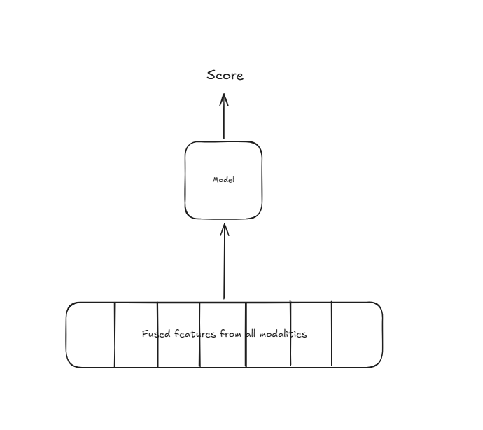

# ML System Design P3
An ML system design problem involving the design of an event recommendation system, something akin to [EventBrite](https://www.eventbrite.com/).

## Design constraints
We assume that the goal of recommending events using ML is to increase the number of sign-ups by a user for events recommended to them.

There are generally three ways to recommend items to users:
- Rule-based systems
- Embedding-based approaches/Collaborative filtering
- Solving a ranking problem

## Paradigms:
- PairwiseLTR - Given two items and a user query, it will provide an answer as to which among the two is more relevant to the user.
- PointwiseLTR - Given a user item and a user query, it will provide a score indicating the relevance of the item to the user query.
- ListwiseLTR - The best and the most complicated method. SoftRank, LambdaRank, LambdaMart are some ways of performing ListwiseLTR.

## Model Training
- Logistic Regression
    - Simple, easy-to-interpret. 
    - Produces only linear decision boundaries, may not be sufficient to capture nonlinearities embedded in the data.
- Decision Tree
    - Easy to interpret, produces nonlinear decision boundaries.
    - Can overfit easily. Improved with the help of bagging and boosting.
    - Bagging reduces variance by calculating average of slightly uncorrelated quantities. Parallellizable.
    - Boosting reduces both bias and variance. Sequential.
- Neural networks
    - Can learn nonlinearities the best.

## Dataset Model
| <User, Event combined features> | Relevancy label (1 - relevant, 0 - irrelevant) |
| -------- | -------- |
| user1, event1    | 1     |
| user1, event2    | 0     |
| user2, event1    | 0     |

## Evaluation

### Offline metrics 

 $$\text{Precision@k} = \frac{\text{Number of relevant items in top k}}{k}$$

 $$
 \text{mAP} = \frac{\sum\text{Precision@i if ith item is relevant}}{\text{Total number of relevant items}}
 $$

$$\text{Recall@k} = \frac{\text{Number of relevant items in top k}}{\text{Total number of relevant items}}$$

$$\text{MRR} = \frac{1}{n}\sum_{i=1}^{n}{}\frac{1}{\text{rank of the first relevant item}}\$$

$$NDCG = \frac{DCG}{IDCG}$$
$$DCG = \sum_{i=0}^{n-1}\frac{{\text{relevance\_score}_i}}{log_2(i+1)}
$$

$$\text{IDCG is the ideal DCG, i.e., the DCG when the relevance scores are sorted in the correct order and the rank is perfect.}
$$
\
$\text{So NDCG is atmost 1.}$

Here mAP makes most sense.

For online evaluation, CTR, user registrations can be tracked.