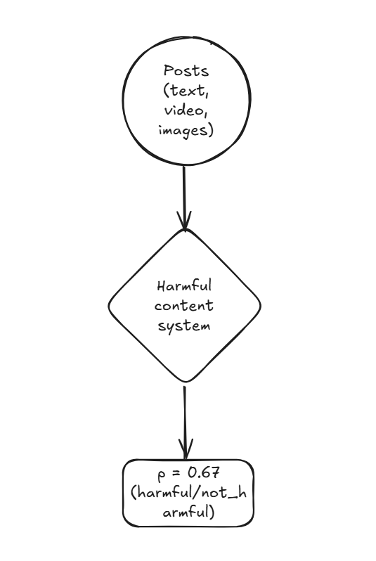
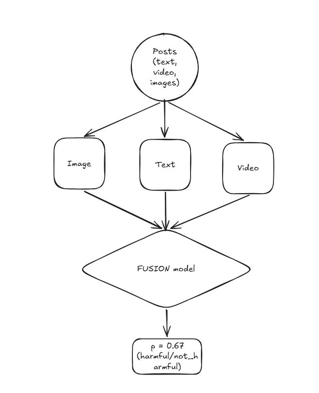
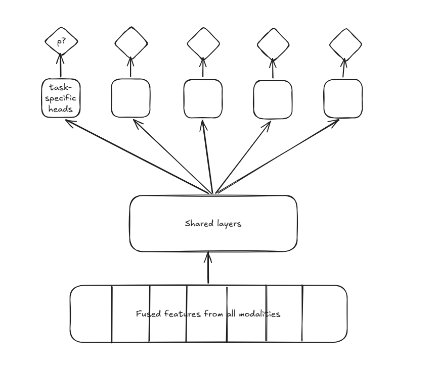
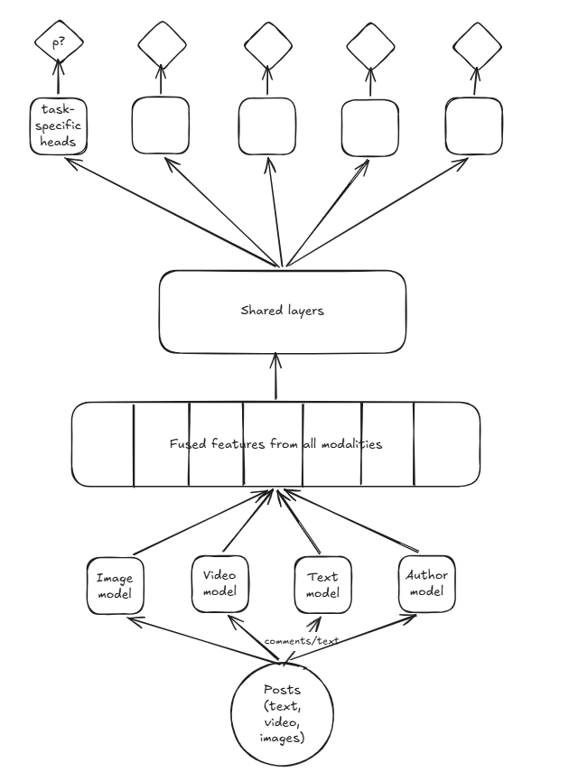

# ML System Design P2
An ML system design problem involving the design of an automated harmful content detection and flagging system.

## Design constraints
- Posts to be flagged
- Posts may contain text, images, and videos.
- Classify if posts contain violent content, prohibited content, sensitive content.
- Explicit feedback from users available.
- Limited human annotation available.

## High level architecture

## Method
Early fusion fuses all the modalities from each post and outputs a probability determining whether the post is harmful or not. The diagram below shows how it would potentially work.

## Classification Methods
- Single binary classifier 
    - Con: No explainability as to which type of content violation was flagged.
- One binary classifier per violation type
    - Con: Expensive to train so many binary classifier.
    - Con: This method does not scale if new types of violations come up.
- Multi-label classifier
    - Shared model for all classes. 
    - Refer to [WPIE](https://ai.meta.com/blog/how-ai-is-getting-better-at-detecting-hate-speech/) for details.
- Multi-task classifier
    - Probably the best among the ones discussed here.
    - Shared layers for feature extraction, followed by task-specific layers, followed by classification heads for each task.
    - Extremely scalable.

>Shared layers are highly effective at performing feature extraction. The extracted features are then passed to task-specific networks for specialized learning.

## Feature engineering

A post contains:
- Text
- Images/Video
- Reactions (likes, shares, comments)
- Contextual information

### Text
- Convert text to embeddings which retain the semantics of the original.
- Embedding models like BERT work very well.
    - Con: BERT is large in size, inference takes time.
    - Con: Works well only on English-language input.
- DistilmBERT addresses both these issues. It's a [multilingual language model.](https://arxiv.org/pdf/2107.00676)

### Image
- Preprocess images
- Feature extraction using [CLIP's](https://openai.com/index/clip/) visual encoder or [SimCLR](https://arxiv.org/pdf/2002.05709).
- For videos, [VideoMoCo](https://arxiv.org/pdf/2103.05905).

### Reactions
- Apply text embedding model to reactions, and average out to obtain one embedding per post.

### Author features 
- Metadata about the post author like violations, user reports, profane word rate, age, gender, and other PII.

### Contextual information
- Device used, time of the day, etc.

## Final architecture

### Model Training

### Hyperparameter tuning
- Refer to this [page](https://docs.cloud.google.com/vertex-ai/docs/training/hyperparameter-tuning-overview) for tuning using Vertex AI.

### Constructing dataset
- Hand labelling (human contractors) (Costly!)
- Natural labelling (user reports on webste) (Cheap!)

### Loss function
- Since we have to classify posts according to the type of content violation, it is a classical binary classification problem, which can be handled with BCE loss.
- Since many modalities are involved, one may dominate due to the nature of the training process. 
    - **[Gradient blending](https://arxiv.org/pdf/1905.12681)** and **[focal loss](https://amaarora.github.io/posts/2020-06-29-FocalLoss.html)** are two techniques to mitigate this issue.
    - Focal loss tries to minimze: $$-\alpha(1-p_t)^{\gamma}\log(p_t)$$ Here, $\alpha$ gives high weights to the rare class, $\gamma$ reduces the loss contribution of easily-classified examples (majority class).

### Evaluation
#### Offline metrics
- <u>PR-AUC curve</u>
    - Obtained by plotting precision and recall on the Y and X axis respectively for a number of thresholds between zero and one. A better model has higher PR-AUC.
- <u>ROC curve</u>
    - Trades off TPR (on Y-axis) and FPR (on X-axis). The left-top-diagonal point is the ideal threshold to be picked for best performance.

#### Online metrics
- <u>Prevalence</u>
    - $$\text{Prevalence} = \frac{\text{Number of harmful posts not prevented}}{\text{Total number of posts on the platform}}$$
    - Should be low.
- <u>Harmful impressions</u>
    - Should be low.
- <u>Valid appeals</u>
    - $$\text{Appeals} = \frac{\text{Number of reversed appeals}}{\text{Number of harmful posts detected}}$$
    - Should be low.
- <u>Proactive rate</u>
    - $$\text{Appeals} = \frac{\text{Number of harmful posts detected}}{\text{Number of harmful posts detected + Number of user reports}}$$
- <u>User reports per harmful class</u>

## Closing Notes
- Allied services around this main service can be:
    - Violation enforcement service (if harmful content detected with high probability, post is removed)
    - Demoting service (if harmful content detected with low probability, post is demoted)
